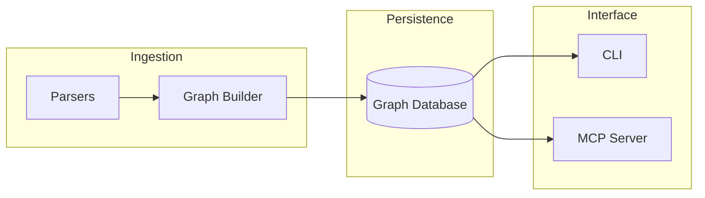

# System Architecture

CodeGraphContext (CGC) is designed as a modular system that bridges the gap between static code analysis and dynamic AI assistance. This page details the core components and data flow within the CGC ecosystem.

## High-Level Overview

CGC consists of three primary layers: the **Ingestion Layer**, the **Persistence Layer**, and the **Interface Layer**.

### 1. Ingestion Layer
This layer is responsible for translating raw source code into semantic graph entities.
*   **Parsers**: Uses Tree-sitter for high-fidelity AST extraction and SCIP for precise symbol resolution across files.
*   **Graph Builder**: Orchestrates the parsing process, resolves imports, and establishes relationships (edges) between nodes.
*   **Background Jobs**: Long-running indexing tasks are managed via an internal job queue to ensure the UI remains responsive.

### 2. Persistence Layer
CGC supports multiple database backends to store the code graph.
*   **Embedded Databases (KùzuDB/FalkorDB Lite)**: Provide zero-latency access for local development without external dependencies.
*   **Networked Databases (Neo4j/Remote FalkorDB)**: Allow for shared indexes across teams and advanced visualization.

### 3. Interface Layer
CGC exposes its capabilities through two main interfaces:
*   **CLI**: A comprehensive command-line tool for developers to manage indexes, run queries, and visualize relationships.
*   **MCP Server**: An implementation of the Model Context Protocol, enabling AI agents to interact with the code graph via structured tool calls.

---

## Data Flow: Indexing

When you run `cgc index`, the following sequence occurs:

1.  **File Discovery**: The system scans the target directory, respecting `.gitignore` and `.cgcignore` rules.
2.  **Parsing**: Individual files are parsed in parallel using multi-threading.
3.  **Entity Resolution**: The builder identifies cross-file references (e.g., a function call in File A to a definition in File B).
4.  **Transaction Commit**: The resulting nodes and edges are committed to the active database backend in optimized batches.

## Data Flow: MCP Querying

When an AI agent (e.g., Claude) requests code context:

1.  **Tool Call**: The agent issues a tool call (e.g., `analyze_code_relationships`).
2.  **Query Translation**: The MCP server translates the tool call into an optimized Cypher or backend-specific query.
3.  **Graph Traversal**: The database engine traverses relationships to find the requested information.
4.  **Response Formatting**: The server cleans and formats the results (often including source code snippets) for the AI to consume.
