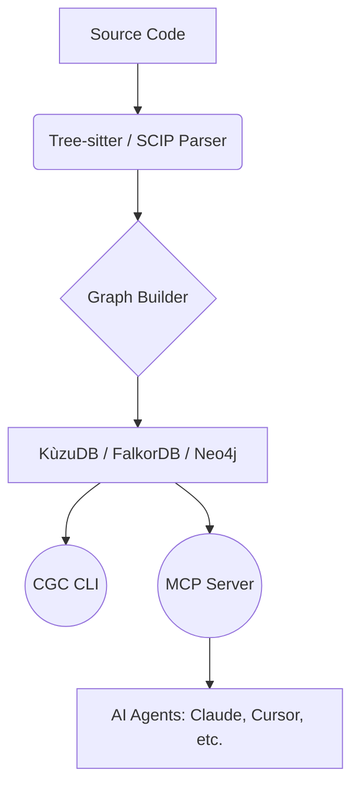

# CodeGraphContext (CGC)

CodeGraphContext is a high-performance **Code Intelligence Engine** that transforms your source code into a queryable property graph. By indexing semantic relationships—such as function calls, class hierarchies, and module dependencies—CGC enables both developers and AI agents to navigate and understand complex codebases with unprecedented depth.

## Key Capabilities

*   **Semantic Indexing**: Goes beyond simple text search by understanding the structural relationships of your code using Tree-sitter and SCIP.
*   **MCP Integration**: Native Model Context Protocol (MCP) support allows AI assistants (Claude, Cursor, VS Code) to perform deep architectural queries.
*   **Multi-Backend Support**: Choose between **KùzuDB** (embedded), **FalkorDB** (high-performance), or **Neo4j** (enterprise) depending on your scale and visualization needs.
*   **Live Monitoring**: Automatically keeps the code graph in sync with your local changes using background watchers.
*   **Portable Bundles**: Package and share indexed codebases as `.cgc` bundles for instant loading without re-indexing.

---

## Getting Started

Follow these steps to integrate CodeGraphContext into your workflow:

1.  **[Installation](getting-started/installation.md)**: Install the CLI and choose your database backend.
2.  **[Quickstart](getting-started/quickstart.md)**: Index your first repository in under 5 minutes.
3.  **[MCP Setup](getting-started/mcp-setup.md)**: Connect CGC to your favorite AI assistant.

---

## Core Architecture

CGC operates as a bridge between your raw source files and your development tools.

For a deeper dive into the system design, see the **[Architecture Guide](concepts/architecture.md)**.

---

## Why CodeGraphContext?

Modern codebases are too large to hold in a single context window. CodeGraphContext solves this by providing:

*   **Precision**: Find exactly who calls a function across 100+ modules instantly.
*   **Context**: Provide AI agents with the specific graph slices they need to solve complex bugs.
*   **Efficiency**: Reduce re-indexing time with incremental updates and pre-built bundles.

---

[GitHub Repository](https://github.com/CodeGraphContext/CodeGraphContext) | [Issues](https://github.com/CodeGraphContext/CodeGraphContext/issues) | [License](license.md)
